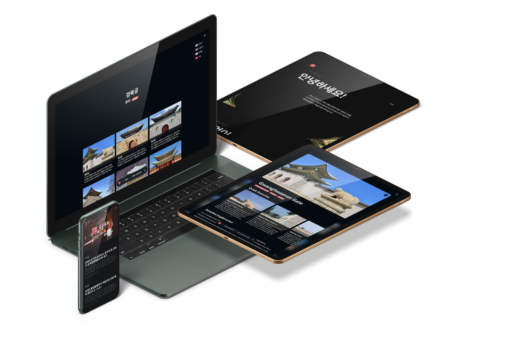

# JaeWoong Suh 🇰🇷

_The developer of morning calm._

## About Me 👋

I am a **South Korean** student attending an American (AP) international school, who is interested in both **computer
science** and **Korea's rich culture and history**.

## Live Projects 🚀

For more info, please visit my [website](https://suhjae.dev) and [GitHub](https://github.com/SuhJae). Also it does not include projects that I worked on for other people.

[**BlueScript**](https://bluescript.app/) - 2024

> BlueScript is a non-profit organization that develops free and open-source tools to help dyslexic individuals. Serving 13k+ monthly active users with 6 partner institutions.

[**Joseon Space LUMA**](https://github.com/SuhJae/luma) - 2024

> A web application that provides a overview of Joseon dynasty's palaces (Gyeongbokgung, Changdeokgung, Changgyeonggung,
> Deoksugung), and Jongmyo. Also provides a netural language search engine and autocomplete.

_Currently in [compleate rewrite](https://SuhJae/neo-luma) to use Nuxt.js and Vite.
Expected to be released in december 2024._

[**SuhJae's Atheneum**](https://blog.suhjae.dev) - 2023

> A personal blog of me, made to be a place were I can share my notes on the AP computer science course to my friends.

**[Gung Gung You You](https://engung.joseon.space)** - 2023

> A web application that provides all events and notices coming from the palaces of Joseon dynasty. Also provides a
> netural language search engine and autocomplete and macine translation.

_Deprecated as Korean government has updated their [official website](https://royal.khs.go.kr/), implimenting a similar features and design in 2024._

**[Joseon Space](https://joseon.space)** - 2021

> The main website of Joseon Space project. Provides a overview of Joseon Space project and its subprojects. The oldest
> project of Joseon Space project.

## Tech Stack 💻

Click to expand!

### Languages

    

### Frontend

      

### Backend & DevOps

  

   

### AI & Data Science

     

### Databases

   

## GitHub Trophies 🏆

## Language Status 🌎

